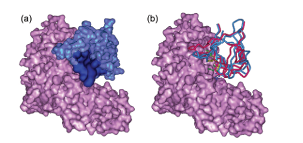

# PSAIA-Manual

[](https://github.com/RUC-MIALAB/PSAIA/releases)

[](https://psaia.readthedocs.io/en/latest/?badge=latest)

# Table of contents

- [Introduction](#introduction)
- [Detailed Document](#detailed-document)
- [Web Server](#web-server)
- [License and credits](#license-and-credits)
- [Data](#data)
- [Necessary Program](#necessary-program)
- [Run](#run)
- [Contact](#contact)


## Introduction

**Division of Protein Surface Patches and Its Application in Protein Binding Site Prediction**, WANG Pan-Wen, GONG Xin-Qi, LI Chun-Hua, CHEN Wei-Zu, WANG Cun-Xin. [[Paper]](https://doi.org/10.3866/PKU.WHXB201208162)



**Abstract:** Binding site prediction for protein-protein complexes is a challenging problem in the area of computational molecular biology. Using a set of double-chain complexes in Benchmark 3.0, we calculated the solvent accessible surface areas and inter-residue contact areas for each monomer and propose a division method of protein surface patches. We found that the products of the solvent accessible surface areas and internal contact areas of patches, the PSAIA values, could provide protein binding site information. In a dataset of 78 complexes, either receptors or ligands of 74 complexes had interface patches with the first or second greatest PSAIA values among all surface patches. A good docking result was achieved when the binding site information obtained with this method was applied in Target 39 of the CAPRI experiment. This patch-based protein binding site prediction method differs from traditional methods, which are based on single residue and consider only surface residues. This provides a new method for binding site prediction in protein-protein interactions.

## Detailed Document

To make it more convenient to use and understand the details of PSAIA, we have prepared a comprehensive documentation for PSAIA.[PSAIA-Docs](https://psaia.readthedocs.io/en/latest/?badge=latest)

## Web Server

We have made an online server where you can upload data and get results through PSAIA. The server's link is provided here:[PSAIA-Server](http://mialab.ruc.edu.cn/PSAIAServer/)

## License and credits

The project PSAIA is licensed under [MIT](./LICENSE).
If you use this code in any future publications, please cite the following publications for general purpose:

- WANG Pan-Wen, GONG Xin-Qi, LI Chun-Hua, CHEN Wei-Zu, WANG Cun-Xin. Division of Protein Surface Patches and Its Application in Protein Binding Site Prediction[J]. Acta Phys. -Chim. Sin. 2012, 28(11), 2729-2734. 
- [](https://doi.org/10.3866/PKU.WHXB201208162)
- In addition, please follow [the bib file](CITATIONS.bib) to cite the methods you used.
- This program needs Naccess, And it is currently not open source and needs to be downloaded from http://www.bioinf.manchester.ac.uk/naccess/ .
- This program needs Qcontacts, And it is currently open source and can be downloaded from https://github.com/brunoV/qcons.

## Data

This program needs pdb-format files of double-chain proteins, you can download them from [RCSB PDB: Homepage](https://www.rcsb.org/).

## Necessary Program


If you already have Naccess , you need to put the directory named naccess2.1.1 which contains install.scr into Program/.  

Then perform the following operations :

```
sudo apt-get install csh
cd Program/naccess2.1.1/
csh install.scr
cd ../../
```

Also, you need to put the directory named Qcontacts which contains the executable file Qcontacts in Program/. 

Then perform the following operations to install the corresponding dependencies : 

```
sudo apt-get install lib32z1
```

or 

```
sudo apt-get install lib32ncurses5
```

After this, run the following order:

```
cd Program/Qcontacts
ldd Qcontacts
```

If you can see its dependencies, you can go on. If not, you need to check if the versions of the relevant libraries are correct.

Also, If you would like to learn more about the detailed configuration of the software, please refer to this documentation. [Easy Installation — PSAIA](https://psaia.readthedocs.io/en/latest/quick_start/easy_install_PSAIA.html#requirements)

## Run

Put pdb files of proteins in the folder named /data/pdb/.

Then run the following order to run:

```
bash main.sh
```

You can change the number of top patches in  sort_patch.sh

Then, you will get the results in the folder: /result/

If you want to know how to read the result file, please refer to this [PSAIA-result](https://psaia.readthedocs.io/en/latest/quick_start/How_to_Read_the_results.html) .


## Contact

If you have any questions, please contact with: 13168zsl@ruc.edu.cn


